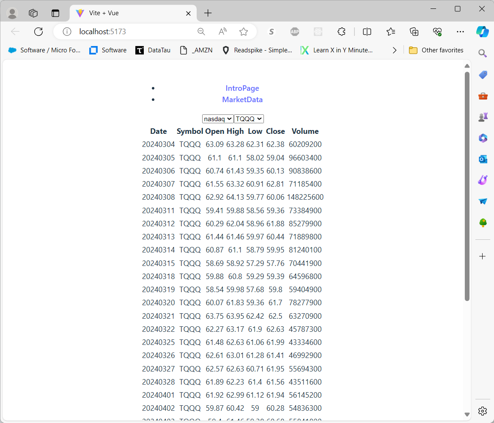

# Another EOD Service UI for Browsing Historical Stock Market OHLCV Data

## Description:
- A very simple [Vue.js](https://vuejs.org/) front end for [EOD Service](https://github.com/mring33621/eod-service) REST API.
- Uses the [Vite](https://vitejs.dev/) 'Vue' template
- Uses a very basic 'TabbedInterface' component for switching between multiple 'pages'
- Uses Vite's built-in proxy to forward requests to the EOD Service API, avoiding CORS issues, in local/dev mode
- I built this in order to learn a bit about Vue.js and Vite
- Similar to the [React version of the same project](https://github.com/mring33621/eod-service-ui-v2), but with Vue.js

## TODO:
- [ ] Add some styling
- [ ] Add some graphs
- [ ] Add a 'Symbol Search' component
